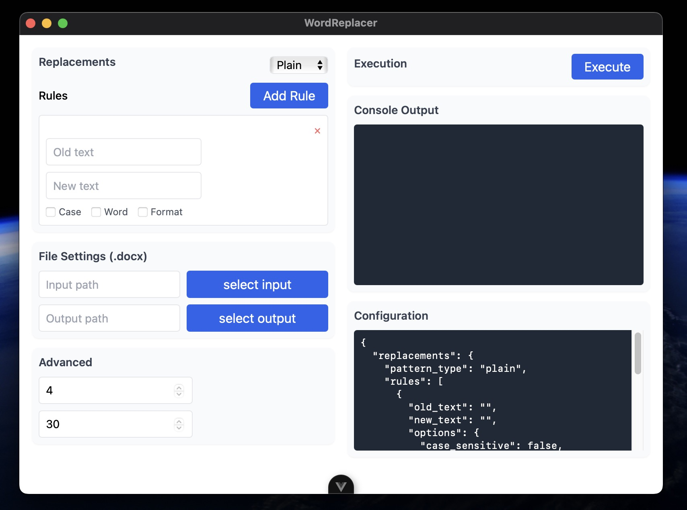

# word-replacer-tauri

A simple word replacer written in Rust using Tauri.

## 介绍

这个项目是一个简单 Word `docx` 文字替换器，使用`Rust`编写，并使用`Tauri`作为前端框架。
借用了 [wr-cl](https://github.com/lanseria/wr-cl) 可执行文件，以实现跨平台(windows/macos-arm/linux)



## 开发

根据不同的平台，下载 `wr-cl` 压缩包

- [wr-cl-linux.tar.gz](https://github.com/lanseria/wr-cl/releases/download/v1.0.0/wr-cl-linux.tar.gz)
- [wr-cl-macos.tar.gz](https://github.com/lanseria/wr-cl/releases/download/v1.0.0/wr-cl-macos.tar.gz)
- [wr-cl-windows.exe.tar.gz](https://github.com/lanseria/wr-cl/releases/download/v1.0.0/wr-cl-windows.exe.tar.gz)

解压后有以下两个文件

- `wr-cl`
- `config.json.template`

将这两个文件分别移动至 `src-tauri/binaries/`, `src-tauri/resources/` 目录下

并分别重命名为 `wr-cl`, `wr-cl-$TARGET_TRIPLE` , `config.json`

## 已知 wr-cl 的参数说明

```json
{
  "replacements": {
    "pattern_type": "plain|regex",
    "rules": [
      {
        "old_text": "\\b公司A\\b",
        "new_text": "DeepSeek",
        "options": {
          "case_sensitive": true,
          "whole_word": true,
          "preserve_format": true
        }
      }
    ]
  },
  "file_settings": {
    "input_path": "./docs",
    "file_types": [".docx"],
    "output_path": "./modified"
  },
  "advanced": {
    "max_workers": 4,
    "timeout": 30
  }
}
```

根据这个参数说明，使用 vue3 以及 unocss 实现一个简单页面

都使用 input 来实现，使用 vue3 的响应式特性，实现双向绑定，做好一定的排版，重复的样式请使用 unocss 的 shortcut 来实现

## 发布

```bash
git tag -d v1.1.0
git push origin --delete v1.1.0
git tag -a v1.1.0 -m "Release version 1.1.0"
git push origin v1.1.0
```

## 许可证

MIT
